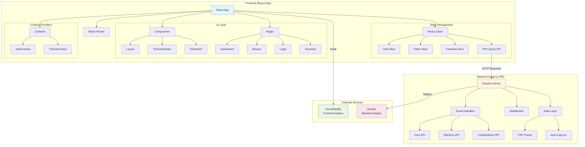
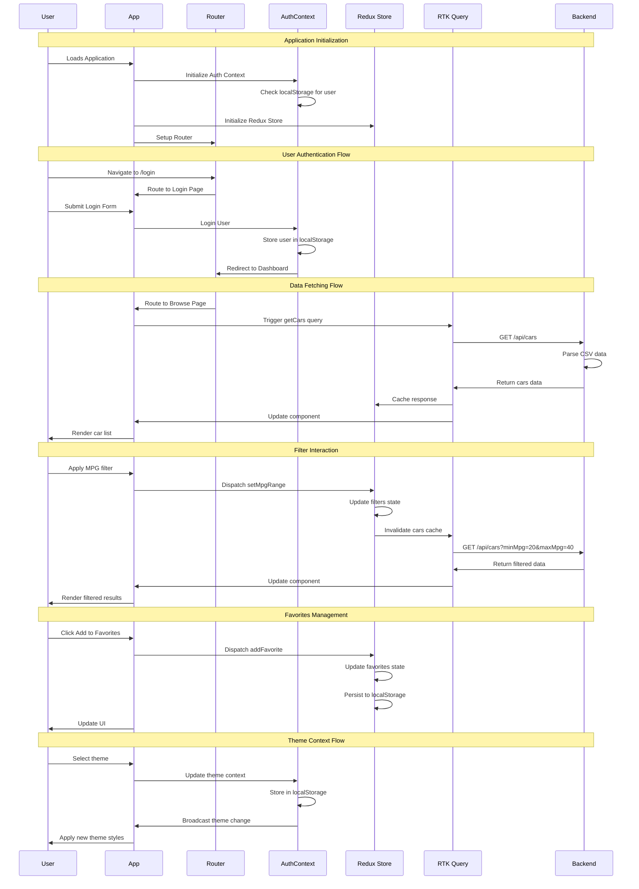
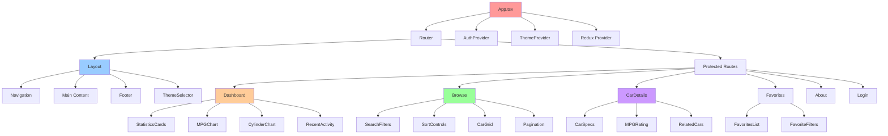
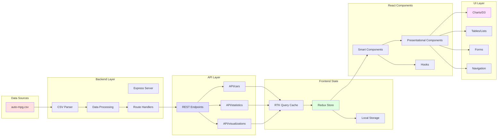

# 🚗 WEX Fuel Economy Fullstack Application

A comprehensive React-based web application for analyzing automotive fuel economy data with interactive visualizations, user authentication, and advanced filtering capabilities.

## 🌟 Features

### 🔐 Authentication System ✅
- User registration and login with form validation
- Session persistence with localStorage
- Protected routes with automatic redirects
- Toggle between login/signup modes

### 📊 Data Visualization ✅
- Interactive D3.js charts and graphs
- MPG trends by year analysis
- Cylinder count vs efficiency comparisons
- Real-time data filtering and sorting

### 🚙 Vehicle Management ✅
- Comprehensive vehicle database browser (Species Gallery equivalent)
- Advanced search and filtering by make, model, origin
- Detailed vehicle specifications view (Detailed Species View equivalent)
- Favorites system with user persistence
- Grid and list view toggles

### 🎨 User Experience ✅
- Responsive design (mobile-first approach)
- Smooth animations with Framer Motion
- Loading states and error boundaries
- Accessibility features (ARIA labels, keyboard navigation)

### Technology Stack
- **Frontend**: React 18+, TypeScript, Tailwind CSS
- **State Management**: Redux Toolkit with RTK Query + AuthContext
- **Routing**: React Router v6 with Protected Routes
- **Visualizations**: D3.js for interactive charts
- **Animations**: Framer Motion
- **Backend**: Node.js/Express (deployed on Render)
- **UI Components**: Lucide React icons
- **Backend**: Node.js, Express, CSV Parser

## 🏗️ Architecture Overview

### System Architecture Diagram



### Component Interaction Diagram



### Frontend Component Hierarchy



### Data Flow Architecture



## 📁 Project Structure

```
fuel-economy-app/
├── backend/                 # Node.js Express API
│   ├── server.js           # Main server file
│   ├── auto-mpg.csv        # Dataset
│   └── package.json        # Backend dependencies
├── frontend/               # React TypeScript App
│   ├── public/
│   ├── src/
│   │   ├── components/     # Reusable components
│   │   ├── pages/          # Route components
│   │   ├── services/       # API services
│   │   ├── store/          # Redux store & slices
│   │   ├── types/          # TypeScript definitions
│   │   └── App.tsx         # Main app component
│   └── package.json        # Frontend dependencies
└── README.md              # This file
```

## 🛠️ Installation & Setup

### Prerequisites
- Node.js (v16 or higher)
- npm or yarn

### Backend Setup
```bash
cd backend
npm install
npm run dev
```
The API will start on `http://localhost:5000`

### Frontend Setup
```bash
cd frontend
npm install
npm start
```
The app will start on `http://localhost:3000`

## 🎯 API Endpoints

- `GET /` - API information
- `GET /api/cars` - Get cars with filtering/pagination
- `GET /api/cars/:id` - Get single car details
- `GET /api/statistics` - Get dataset statistics
- `GET /api/visualizations/mpg-by-year` - MPG trend data
- `GET /api/visualizations/mpg-by-cylinders` - MPG by cylinders
- `GET /api/health` - Health check

## 🎨 Key Features

### Interactive Dashboard
- **Live Search**: Real-time filtering by car name
- **Advanced Filters**: MPG range, cylinders, origin, year range
- **Dynamic Sorting**: Multiple sort options with visual indicators
- **Pagination**: Efficient data loading with page controls

### Data Visualizations
- **MPG Trend Chart**: Line chart showing fuel economy over years
- **Cylinder Analysis**: Bar chart of MPG by cylinder count
- **Origin Distribution**: Pie chart of cars by country
- **Weight vs MPG Scatter**: D3-powered interactive scatter plot

### Favorites System
- **Persistent Storage**: localStorage-based favorites
- **Multiple Types**: Save cars, searches, and visualizations
- **Category Tabs**: Organized view by favorite type
- **Quick Actions**: Add/remove with toast notifications

### Car Details Page
- **Creative Interactions**: Mouse-responsive background animations
- **Comprehensive Specs**: Performance metrics and efficiency analysis
- **Visual Design**: Modern card-based layout with icons
- **Favorite Integration**: Add/remove from favorites

## 🎭 Creative Elements

### Mouse Interactions
- **Car Details Page**: Dynamic background shapes that follow mouse movement
- **Hover Effects**: Smooth animations on cards and buttons
- **Loading States**: Animated spinners and skeleton screens

### Visual Design
- **Color System**: Consistent color palette with semantic meanings
- **Typography**: Hierarchical text styling with proper contrast
- **Spacing**: Systematic spacing using Tailwind's scale
- **Responsive**: Mobile-first design with breakpoint optimizations

## 📊 Data Processing

The application processes automotive fuel economy data including:
- **Performance Metrics**: MPG, horsepower, acceleration
- **Engine Specs**: Cylinders, displacement
- **Vehicle Info**: Weight, model year, country of origin
- **Calculated Fields**: Power-to-weight ratio, efficiency ratings

## 🔧 Development Decisions

### State Management
- **Redux Toolkit**: Simplified Redux with RTK Query for API calls
- **Local State**: React hooks for component-specific state
- **Persistence**: localStorage for favorites with error handling

### Type Safety
- **TypeScript**: Complete type coverage for better DX
- **API Types**: Strongly typed API responses and requests
- **Component Props**: Typed component interfaces

### Performance
- **Code Splitting**: Route-based code splitting
- **Memoization**: Strategic use of React.memo and useMemo
- **API Caching**: RTK Query automatic caching and invalidation

## 🚀 Deployment

### Frontend (Vercel/Netlify)
```bash
npm run build
# Deploy build folder
```

### Backend (Render/Fly.io)
```bash
# Backend ready for deployment
# Environment variables: PORT (default: 5000)
```

## 📝 Development Notes

This project demonstrates:
- Modern React patterns with hooks and functional components
- Advanced TypeScript usage with proper type definitions
- Complex state management with Redux Toolkit
- Data visualization best practices
- Responsive design principles
- API design and documentation
- Performance optimization techniques
- User experience considerations

## 🤝 Contributing

This is a take-home coding challenge project. For questions or feedback, please reach out to the development team.

## 📄 License

This project is for demonstration purposes as part of a coding challenge.
